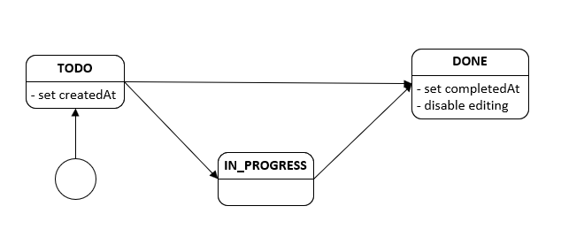

# task-tracker-api
## 1. Project overview
This project is a REST API backend for task management.
It is focused on a clear domain-driven model and rules for task state transitions (todo, in progress, done).
It is being developed as a foundation for a future multi-user task/project management system.

Currently, the project contains the “task” domain, which supports both basic CRUD operations and search, filtering, and pagination.
The module behavior is strictly constrained by domain rules and business logic.


## 2. Tech stack
- Java 21
- Spring Boot
- Spring Data JPA
- PostgreSQL
- MapStruct
- Hibernate


## 3. Domain model
### Task entity
The “Task” model is an entity for representing a task, 
containing information about the task and its current status.

Current structure:
- id
- title
- description
- status
- createdAt
- completedAt

The “status” field is clearly defined by the rules for transitions between states:
```
TODO → IN_PROGRESS
IN_PROGRESS → DONE
TODO → DONE
```
The creation time and completion time are fixed and are set automatically when the task enters the corresponding status.
After the task is completed, it becomes unavailable for editing.




## 4. API overview
Currently, API supports the following methods:
#### POST
- Creation task:
`/tasks`
```JSON
{
    "title": "task",
    "description": "description"
}
```
#### PATCH
- Editing task:
`/tasks/1`
```JSON
{
  "title": "updated",
  "description": "updated"
}
```
- Editing status:
`/tasks/1/status`
```JSON
{
  "status": "DONE"
}
```

#### GET
- Getting task:
`/tasks/1`

- Getting page (pagination):
`/tasks?page=3&size=2`

- Getting page with sort and filter:
`/tasks?status=TODO&page=0&size=20&sortField=createdAt&sortDir=ASC`

#### DELETE
- Deleting task
`/tasks/1`

## 5. Validation & error handling
The project includes input validation via jakarta.validation.

GlobalExceptionHandler is present.

Custom exceptions are implemented according to domain rules, such as: 
- CannotEditTaskInCurrentStatusException
- InvalidTaskStatusTransitionException
- EmptyPatchException

and others.

## 6. Running thr project locally
#### Prerequisites
- Java 21
- Maven
- Docker & Docker Compose

#### Configuration files
You can find sample application.properties and docker-compose.yaml 
files in the repository with the .example extension.

#### The project uses PostgreSQL running in Docker.
From the project root, run:
```bash
docker-compose up -d
```
This will start a PostgreSQL container with the following configuration:
- Database: tasktracker_db
- Username: user
- Password: password
- Port: 5432

#### Configure application properties

Make sure your application.properties contains matching database settings:
```properties
spring.datasource.url=jdbc:postgresql://localhost:5432/tasktracker_db
spring.datasource.username=user
spring.datasource.password=password
```

#### Run the application
You can start the application using Maven:
```bash
mvn spring-boot:run
```
Or by running the main Spring Boot class from your IDE.

#### Verify the application
Once started, the application will be available at:
```http request
http://localhost:8080
```
You can interact with the API using any HTTP client (Postman, curl, etc.).


## 7. Project structure
The project includes:
- TaskController
- TaskService
- Task (Entity)
- TaskRepository
- DTOs for create, response, update and search
- GlobalExceptionHandler and custom exceptions


## 8. Next steps
### planned:
- Users and authentication
- Task ownership and permissions
- Projects and task grouping
- Role-based access control
- Testing

### under consideration:
- Calendar integration and reminders
- Custom task workflows and columns
- Analytics and productivity insights
- Architecture evolution (modular monolith vs microservices)


